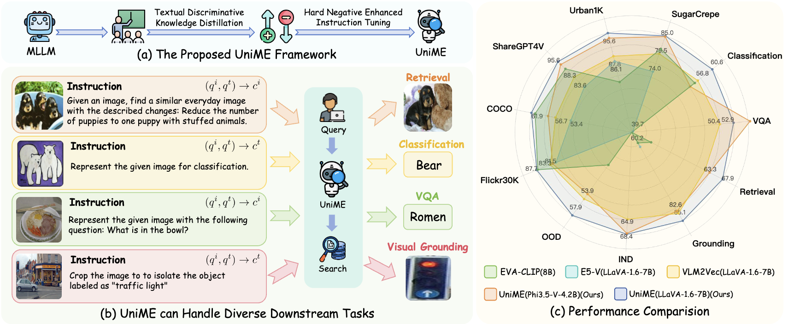
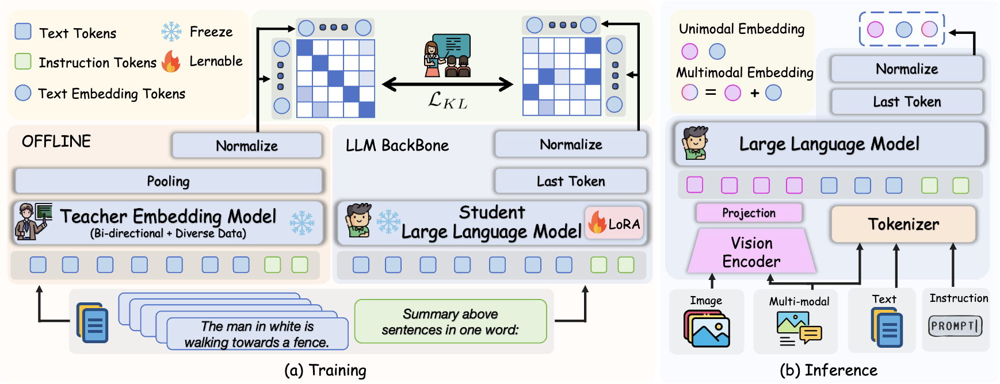
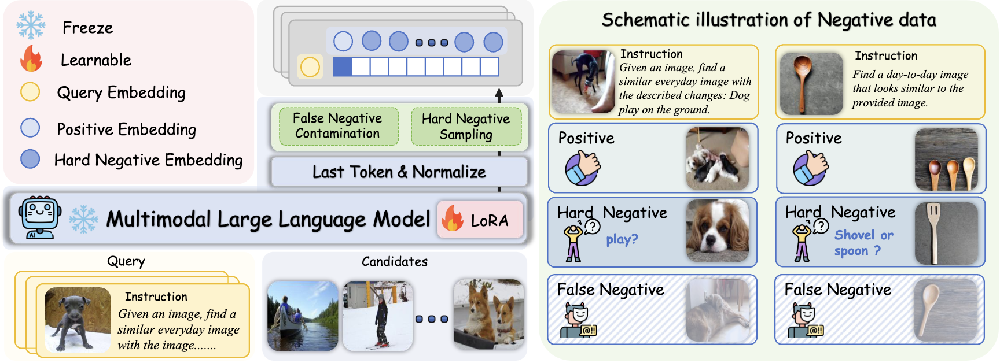
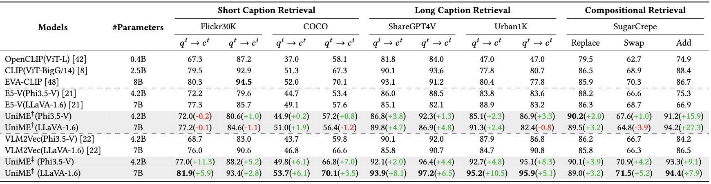
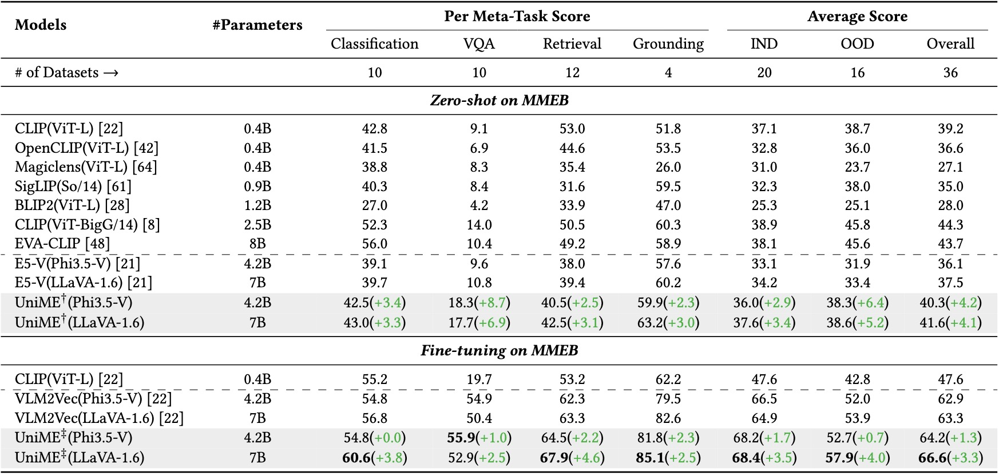

# Breaking the Modality Barrier: Universal Embedding Learning with Multimodal LLMs
<a href="https://scholar.google.com/citations?hl=zh-CN&user=9etrpbYAAAAJ">Tiancheng Gu*</a>,</span>
<a href="https://kaicheng-yang0828.github.io">Kaicheng Yang*</a>,</span>
Ziyong Feng,</span>
<a href="https://github.com/wangxingjun778">Xingjun Wang</a>,</span>
Yanzhao Zhang,</span>
<a href="https://scholar.google.com/citations?user=jb1Htg4AAAAJ&hl=zh-CN">Dingkun Long</a>,</span>
<a href="https://scholar.google.com/citations?hl=en&user=ENJA2f8AAAAJ&view_op=list_works&sortby=pubdate">Yingda Chen</a>,</span>
<a href="https://weidong-tom-cai.github.io/">Weidong Cai</a>,</span>
<a href="https://jiankangdeng.github.io">Jiankang Deng</a></span>

[🏡 Project Page](https://garygutc.github.io/UniME) |  [📄 Paper](https://arxiv.org/pdf/2504.17432) | UniME(Phi3.5-V-4.2B) [🤗](https://huggingface.co/DeepGlint-AI/UniME-Phi3.5-V-4.2B)/[🤖](https://www.modelscope.cn/models/AI-ModelScope/UniME-Phi3.5-V-4.2B) | UniME(LLaVA-v1.6-7B)[🤗](https://huggingface.co/DeepGlint-AI/UniME-LLaVA-1.6-7B)/[🤖](https://www.modelscope.cn/models/AI-ModelScope/UniME-LLaVA-1.6-7B)



## 🎺 News
- [2025/04/24]: ✨We release the evaluate and demo code.
- [2025/04/24]: ✨The paper of UniME is submitted to [arxiv](https://arxiv.org/pdf/2504.17432).
- [2025/04/22]: ✨We release the model weight of UniME in [🤗 Huggingface](https://huggingface.co/collections/DeepGlint-AI/unime-6805fa16ab0071a96bef29d2)

## 💡 Highlights
To enhance the MLLM's embedding capability, we propose textual discriminative knowledge distillation. The training process involves decoupling the MLLM's LLM component and processing text with the prompt "Summarize the above sentences in one word.", followed by aligning the student (MLLM) and teacher (NV-Embed V2) embeddings via KL divergence on batch-wise similarity distributions. **Notably, only the LLM component is fine-tuned during this process, while all other parameters remain frozen**. 



After that, we propose hard negative enhanced instruction tuning enhances multimodal systems by improving visual sensitivity, strengthening cross-modal alignment, and boosting instruction-following capabilities. At its core are two key innovations: a false negative filtering mechanism using a similarity threshold to eliminate misleading samples, and an automatic hard negative sampling strategy that selects top-k similar but non-matching examples to increase training difficulty. 


## 📗 Enviroment
```bash
conda create -n uniME python=3.10 -y
conda activate uniME
pip install -r requirements.txt
```

## 🧭 Quick Start
```bash
git clone https://github.com/deepglint/UniME.git
cd UniME
```

```python
import torch
from PIL import Image
from torch.nn import functional as F
from self_evaluate.utils.utils import init_model_and_transform


model_name = "phi35V"
base_model_path="DeepGlint-AI/UniME-Phi3.5-V-4.2B"
# model_name = "llava_16"
# base_model_path="DeepGlint-AI/UniME-LLaVA-1.6-7B"

if model_name == "phi35V":
    img_prompt = '<|user|>\n<|image_1|>\nSummary above image in one word: <|end|>\n<|assistant|>\n'
    text_prompt = '<|user|>\n<sent>\nSummary above sentence in one word: <|end|>\n<|assistant|>\n'
elif model_name == "llava_16":
    img_prompt = "[INST] <image>\nSummary above image in one word: [/INST]"
    text_prompt = "[INST] <sent>\nSummary above sentence in one word: [/INST]"

text = "A man is crossing the street with a red car parked nearby."
image_path = "figures/demo.png"
input_texts = text_prompt.replace('<sent>', text)
input_image_prompt = img_prompt
input_image = [Image.open(image_path)]

model, transform = init_model_and_transform(model_name, base_model_path)
inputs_text = transform(text=input_texts,
                    images=None,
                    return_tensors="pt", 
                    padding=True)
for key in inputs_text: inputs_text[key] = inputs_text[key].to("cuda")
inputs_image = transform(text=input_image_prompt,
                    images=input_image, 
                    return_tensors="pt", 
                    padding=True).to("cuda")

with torch.no_grad():
  emb_text = model(**inputs_text, output_hidden_states=True, return_dict=True).hidden_states[-1][:, -1, :]
  emb_image = model(**inputs_image, output_hidden_states=True, return_dict=True).hidden_states[-1][:, -1, :]
  emb_text = F.normalize(emb_text, dim=-1)
  emb_image = F.normalize(emb_image, dim=-1)
  Score = emb_image @ emb_text.T
print("Score: ", Score) # Score: 0.59
```

## 🌡️ Evaluation
### Diverse Retrieval
1.Please prepare data follow [Flickr, CoCo](https://github.com/kongds/E5-V#evaulate), [ShareGPT4V, Urban1k](https://github.com/beichenzbc/Long-CLIP#evaluation), [SugarCrepe](https://github.com/RAIVNLab/sugar-crepe)

2.Edit data path in "self_evaluate/utils/data_path.py".
```bash
# Phi35V
bash shell/test_Phi35V.sh

# LLaVA1.6-mistral
bash shell/test_LLaVA16.sh
```
### MMEB
1.Follow [MMEB](https://github.com/TIGER-AI-Lab/VLM2Vec#inference--evaluation)
```bash
git clone https://github.com/TIGER-AI-Lab/VLM2Vec.git
cd VLM2Vec
wget https://huggingface.co/datasets/TIGER-Lab/MMEB-eval/resolve/main/images.zip
unzip images.zip -d eval_images/
```
```bash
cd VLM2Vec
#! Don't forget to edit data path
##### Phi35v
mkdir ../evaluate_results/uniME_phi35V/
python eval.py --model_name ../models/uniME_phi35V \
  --model_backbone phi3_v \
  --encode_output_path ../evaluate_results/uniME_phi35V/ \
  --num_crops 4 --max_len 256 \
  --pooling last --normalize True \
  --dataset_name TIGER-Lab/MMEB-eval \
  --subset_name N24News CIFAR-100 HatefulMemes VOC2007 SUN397 ImageNet-A ImageNet-R ObjectNet Country211 \
  --dataset_split test --per_device_eval_batch_size 16 \
  --image_dir eval_images/
  
##### llava16
mkdir ../evaluate_results/uniME_llava_16/
python eval.py --model_name ../models/uniME_llava_16 \
  --model_backbone llava_next \
  --encode_output_path ../evaluate_results/uniME_llava_16/ \
  --num_crops 4 --max_len 4096 \
  --pooling last --normalize True \
  --dataset_name TIGER-Lab/MMEB-eval \
  --subset_name N24News CIFAR-100 HatefulMemes VOC2007 SUN397 ImageNet-A ImageNet-R ObjectNet Country211 \
  --dataset_split test --per_device_eval_batch_size 16 \
  --image_dir eval_images/ 
```
## 🔢 Results
### Diverse Retrieval


### MMEB



## 👏 Acknowledgements
Many thanks to the code bases from [E5-V](https://github.com/kongds/E5-V), [VLM2VEC](https://github.com/TIGER-AI-Lab/VLM2Vec), [LamRA](https://github.com/Code-kunkun/LamRA), [ms-swift](https://github.com/modelscope/ms-swift), [sugar-crepe](https://github.com/RAIVNLab/sugar-crepe), [LongCLIP](https://github.com/beichenzbc/Long-CLIP#evaluation), [tevatron](https://github.com/texttron/tevatron).


## 📖 Citation
If you find this repository useful, please use the following BibTeX entry for citation.
```latex
@misc{gu2025breakingmodalitybarrieruniversal,
      title={Breaking the Modality Barrier: Universal Embedding Learning with Multimodal LLMs}, 
      author={Tiancheng Gu and Kaicheng Yang and Ziyong Feng and Xingjun Wang and Yanzhao Zhang and Dingkun Long and Yingda Chen and Weidong Cai and Jiankang Deng},
      year={2025},
      eprint={2504.17432},
      archivePrefix={arXiv},
      primaryClass={cs.CV},
      url={https://arxiv.org/abs/2504.17432}, 
}
```
